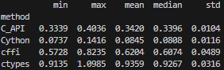

## Ключевые результаты

- **Самый быстрый способ:** Cython (0.097 с) — в 11.5 раз быстрее ctypes и в 4.4 раза быстрее C API.
- **Самый простой в реализации:** ctypes — встроен в стандартную библиотеку Python, не требует компиляции, достаточно загрузить библиотеку и описать сигнатуру функции.
- **Наиболее удобный для сопровождения:** Cython — код визуально близок к Python, поддерживает статическую типизацию, автодополнение в IDE и нативную работу с массивами NumPy.

## Причины различий в производительности

- **ctypes** — динамическая проверка типов и упаковка/распаковка аргументов в Python-объекты на каждом вызове создают значительные накладные расходы.
- **cffi** — заранее компилирует C-интерфейс через `cdef`, что ускоряет вызов, но преобразование буферов через `ffi.cast` всё ещё добавляет задержки.
- **CPython C API** — прямой доступ к интерпретатору Python, но ручное управление памятью (`malloc`, работа с `PyObject`) усложняет код и создаёт дополнительные накладные расходы.
- **Cython** — компилируется в чистый C-код, работает с указателями напрямую, избегает создания временных Python-объектов при передаче аргументов, что обеспечивает минимальный FFI-overhead.

## Рекомендация

> Для высоконагруженных вычислений и работы с массивами данных используйте **Cython** — максимальная производительность при удобном синтаксисе.  
> Для простых скриптов, прототипирования или редких вызовов достаточно **ctypes** — минимальные усилия на подключение без необходимости компиляции.

